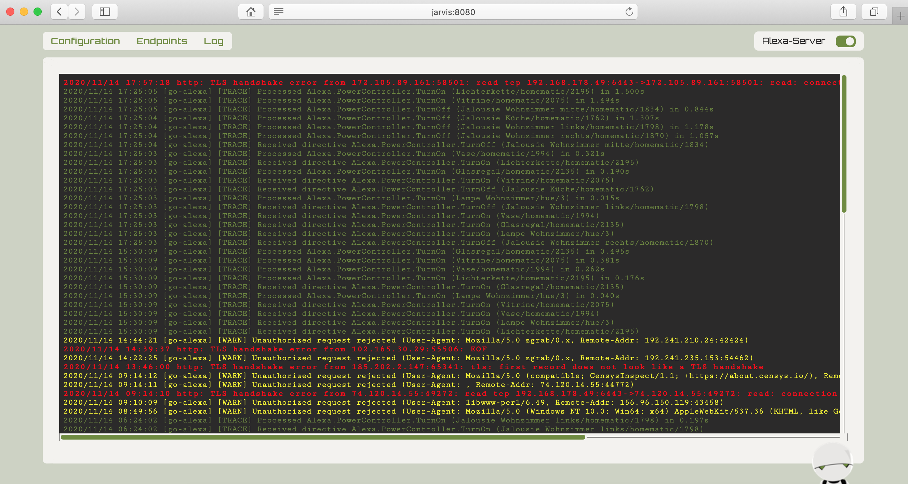

# Marvin-UI - Web-Interface for Marvin home automation middleware

This project targets to extend [Marvin - Home automation middleware](https://github.com/betom84/marvin) with a more powerful user-interface since the one included barely deserves that name. Just like [Marvin](https://github.com/betom84/marvin), i've started this project for my personal use and to get in touch with new stuff to learn from. So i'm looking forward to get in contact for questions, feedback or collaboration!

## Features

-  See logs from Marvin (updates automatically)
-  Check state, start and stop Alexa-Server

## Setup

-  Checkout respository
-  Run `npm install` and `npm run build` to install and build the project
-  Either copy content from build output (`/dist`) to Marvin's `webapp` folder or [change `uiRoot` configuration](https://github.com/betom84/marvin/tree/docs#configuration-configjson) value to point to the folder containing the compiled assets
-  Web-Interface will be served by [Marvin](https://github.com/betom84/marvin) and replaces the existing one
